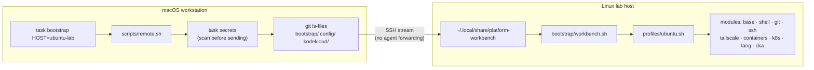

<div align="center">

# platform-workbench

**One checkout on a Mac that bootstraps, updates and verifies a platform-engineering workstation and every lab host it talks to.**

[](LICENSE)


[Quick start](#quick-start) · [How it works](#how-it-works) · [Profiles](#profiles) · [Commands](#commands) · [Safety model](#safety-model) · [Docs](#documentation)

</div>

<div align="center">

### 🧰 What's in the box

<sub>Every badge is wired by a module, one canonical config each. Click one to open its file.</sub>

<table>
<tr><td align="right"><b>🖥️ Terminal</b></td><td align="left"><a href="config/ghostty/config.ghostty"></a> <a href="config/tmux/tmux.conf"></a> <a href="config/herdr/config.toml"></a>  </td></tr>
<tr><td align="right"><b>✍️ Editors</b></td><td align="left"><a href="config/nvim/"></a> <a href="config/vim/vimrc"></a>     </td></tr>
<tr><td align="right"><b>🐚 Shell</b></td><td align="left"><a href="config/shell/zshrc"></a> <a href="config/shell/bashrc"></a> <a href="config/shell/aliases.sh"></a>    </td></tr>
<tr><td align="right"><b>🔀 Git & SSH</b></td><td align="left"><a href="config/git/gitconfig"></a>  <a href="config/ssh/workbench.conf"></a> </td></tr>
<tr><td align="right"><b>☸️ Platform</b></td><td align="left">      </td></tr>
<tr><td align="right"><b>🧪 Languages & LSP</b></td><td align="left">   </td></tr>
<tr><td align="right"><b>🛡️ Quality</b></td><td align="left">   </td></tr>
</table>

```text
dotfiles ──► config/ ──symlink/marker──► ~/.zshrc ~/.tmux.conf ~/.config/nvim ~/.gitconfig …
   │                                         ▲
   └── bootstrap/modules/*.sh ──► profile ───┘   (macos · rhel · ubuntu · proxmox)
```

</div>

---

A homelab tends to drift. Every VM ends up with its own `.bashrc`, the tmux config gets copied around and forked, SSH aliases live in three places, and nobody remembers which box has which version of `kubectl`. **platform-workbench** fixes that with plain Bash and no agents or daemons:

- **One canonical config per tool.** Shell, tmux, Vim, Git, SSH and Ghostty (plus optional Herdr) each have exactly one file under [`config/`](config/), and every machine uses it.
- **Profiles instead of snowflakes.** Each machine gets exactly one profile: `macos`, `rhel`, `ubuntu` or `proxmox`. A profile is a list of modules and packages. That's all.
- **Three verbs.** `bootstrap` installs and wires things up, `update` upgrades only what the profile manages, and `verify` is a read-only health check that exits non-zero on drift.
- **Driven from the Mac.** A fresh Linux host can be bootstrapped over SSH *before* this repository is cloned on it. It needs no Git credentials and no forwarded keys.
- **Reached by name.** `ssh rhel-lab`, `task ubuntu`. Tailscale MagicDNS handles reachability, OpenSSH handles auth, and tmux keeps the session alive.

## Quick start

**Requirements (Mac):** [Homebrew](https://brew.sh) and [Task](https://taskfile.dev) (`brew install go-task`). Everything else is installed by the `macos` profile.

```bash
git clone https://github.com/nawodyaishan/platform-workbench.git
cd platform-workbench

task bootstrap -- --dry-run      # show every change without making it
task bootstrap                   # apply (idempotent; backs up anything it replaces)
task verify                      # read-only health check
```

Then bring a lab host up by name. See [docs/new-machine.md](docs/new-machine.md) for the first-contact steps.

```bash
task ssh:copy-id HOST=ubuntu-lab                 # install your public key, nothing else
task bootstrap HOST=ubuntu-lab -- --dry-run      # review the remote plan
task bootstrap HOST=ubuntu-lab                   # apply it over SSH
task ubuntu                                      # SSH in and attach tmux "main"
```

> [!TIP]
> Forking for your own lab? Host names live in two small files: [`bootstrap/hosts.conf`](bootstrap/hosts.conf) and the `Host` line of [`config/ssh/workbench.conf`](config/ssh/workbench.conf). Addresses, users and keys never go in the repository. They belong in the untracked `~/.ssh/config.d/10-hosts.local.conf`.

## How it works



1. **The engine.** [`bootstrap/workbench.sh`](bootstrap/workbench.sh) takes a verb and a profile. It detects the OS, refuses to run a profile on the wrong kind of host, then calls `<module>_<verb>` for each module in the profile.
2. **The modules.** Each file in [`bootstrap/modules/`](bootstrap/modules/) defines `_bootstrap`, `_update` and `_verify`. Bootstrap and update are idempotent and honour `--dry-run`. Verify never changes anything.
3. **The wiring.** Modules edit your files only through named marker blocks (`# >>> platform-workbench >>>`) or symlinks, and they back up anything they replace to `~/.platform-workbench-backup/<timestamp>/`.
4. **Remote runs.** From the Mac, [`scripts/remote.sh`](scripts/remote.sh) streams only Git-tracked files to the host, keeps the previous payload as `.prev`, and runs the same engine there. The host always runs the revision you reviewed.

Every run ends with the same summary, so drift is easy to spot:

```text
platform-workbench verify  profile=ubuntu  host=ubuntu-lab (Ubuntu 24.04 LTS)

==> shell wiring (verify)
  ok   marker block current in /home/alice/.bashrc
  ok   no legacy marker blocks in /home/alice/.bashrc
  ok   /home/alice/.tmux.conf -> /home/alice/.local/share/platform-workbench/config/tmux/tmux.conf

==> kubernetes tooling (verify)
  ok   kubectl v1.35.2
  ok   crictl
  ok   helm
  ok   k9s

==> summary
  ok=31 warn=0 fail=0 n/a=2 changed=0
```

## Profiles

| Machine | Alias | Profile | What it gets |
|---|---|---|---|
| macOS workstation | local | `macos` | Brewfile, shell, Git, SSH client config, Tailscale, OrbStack check, Kubernetes CLIs, Go, minimal Neovim (Go/TS/YAML) |
| RHEL 9 family VM (RHEL, Alma, Rocky) | `rhel-lab` | `rhel` | Shell, Git, sshd, Tailscale, podman, kubectl/kubeadm, CKA tools, SELinux and admin utilities |
| Ubuntu LTS VM | `ubuntu-lab` | `ubuntu` | Shell, Git, sshd, Tailscale, Docker CE, kubectl/kubeadm, Helm, k9s, CKA tools |
| Proxmox VE host | `proxmox` | `proxmox` | Deliberately minimal: shell config, sshd, Tailscale, host utilities. Nothing else |
| KodeKloud / disposable node | none | none | A paste-in, session-only [shell snippet](docs/kodekloud.md). Nothing installed |

Linux profiles take opt-in extras with `--extras go,node,cka`. See [docs/hosts.md](docs/hosts.md) for the full module list and the steps to add a host.

## Commands

Everything goes through [Task](https://taskfile.dev). Run `task` on its own for the summary.

| Command | What it does |
|---|---|
| `task bootstrap` / `update` / `verify` | Lifecycle for this machine (`macos` on a Mac, otherwise `PROFILE=rhel\|ubuntu\|proxmox`) |
| `task bootstrap HOST=<alias>` (and `update`, `verify`) | The same lifecycle on a registered host, driven from the Mac |
| `task verify:all` | Verify the Mac and every registered host |
| `task main` | Attach to (or create) the local tmux session `main` |
| `task ssh HOST=<alias>`, `task rhel` / `ubuntu` / `proxmox` | SSH to a host and attach its tmux `main` |
| `task hosts` | Registered hosts, resolved SSH target, reachability |
| `task ssh:copy-id HOST=<alias> [KEY=…pub]` | Install a public key on a new host |
| `task gh-key HOST=<alias>` | Give a host its own GitHub key (asks before publishing) |
| `task aliases` | Copy a paste-in installer that adds the aliases and functions to `~/.zshrc` or `~/.bashrc`, no bootstrap needed ([details](docs/config.md#aliases-without-bootstrap)) |
| `task kk [TOPIC=k8s\|terraform\|aws\|ansible\|linux]` | Copy a KodeKloud shell snippet to the clipboard (default: the CKA one) |
| `task check` | `lint` + `secrets` + `repo` |
| `task test:remote`, `task test:profiles` | Offline remote-flow tests; container smoke tests for the Linux profiles |
| `task hooks` | Install the pre-commit hook (secret scan, Markdown formatting) |

Lifecycle flags go after `--`: `--dry-run`, `--yes`, `--extras go,node,cka`.

## Safety model

> [!IMPORTANT]
> This is a public repository by design. It holds only defaults and code. Your identity, addresses and credentials stay on your machines.

- **Nothing private in Git.** Host addresses, SSH users, identity files and Tailscale auth live outside the repository (`~/.ssh/config.d/10-hosts.local.conf`, interactive `tailscale up`). `task secrets` and the pre-commit hook reject private keys, tokens, private IP ranges, tailnet names and personal emails.
- **Only tracked files leave the Mac.** Remote runs stream `git ls-files` output over SSH. No private key, agent or Git credential is forwarded, and `ForwardAgent no` is the default for every host.
- **Idempotent and reversible.** Bootstrap owns only its marker blocks and symlinks and backs up anything it replaces. `--dry-run` shows every change first, and running bootstrap again is the repair path.
- **Scoped updates.** `update` upgrades only the packages a profile manages, never the whole system. Proxmox changes need a typed confirmation, and `pve-*` packages are never touched.
- **Verified downloads.** Vendor repositories are key-checked (the Helm key by fingerprint), and downloaded binaries such as k9s and Go are checksum-verified before install.

## Quality gates

The toolkit targets macOS's stock `/bin/bash` 3.2, so it avoids associative arrays, `mapfile` and `${var,,}`. It is checked on every change:

```bash
task check           # bash -n, zsh -n, shellcheck, vim/tmux/ghostty/git/ssh config validation,
                     # secret scan, host-registry consistency, Markdown link check
task test:remote     # remote payload boundaries and task aliases, without any SSH connection
task test:profiles   # Rocky 9, Ubuntu 24.04 and Debian containers: dry-run -> bootstrap ->
                     # verify -> second bootstrap must change nothing (needs Docker/OrbStack)
```

## Layout

```text
bootstrap/
  workbench.sh        lifecycle engine: <bootstrap|update|verify> --profile <name>
  hosts.conf          registered hosts: <ssh-alias> <profile>
  lib/                OS detection, package managers, marker blocks, host registry
  modules/            base shell git ssh tailscale containers k8s lang nvim cka
  profiles/           macos (+ Brewfile), rhel, ubuntu, proxmox
config/               canonical shell, tmux, vim, nvim, herdr, git, ssh and ghostty configs
kodekloud/            paste-in shell snippets for disposable lab nodes (cka, k8s, terraform, aws, ansible, linux)
scripts/              remote transport, secret scan, repo checks, tests, git hook
docs/                 hosts, new-machine, ssh, config, kodekloud, cheatsheets, ssh-tutorial/
.claude/skills/       agentic spec-driven development skills for AI coding agents
```

## Documentation

| Guide | Covers |
|---|---|
| [Hosts and profiles](docs/hosts.md) | What each machine gets, extras, adding a host |
| [Bootstrapping a machine](docs/new-machine.md) | A new Mac, a fresh Linux host from the Mac, first contact |
| [SSH and Tailscale](docs/ssh.md) | Named hosts, config layering, multiplexing, agent-forwarding policy |
| [Learn SSH (tutorial)](docs/ssh-tutorial/README.md) | Beginner to advanced SSH course built on this repo's real SSH files |
| [Managed configuration](docs/config.md) | The canonical configs, how they are installed, tmux/Vim/Ghostty notes |
| [KodeKloud and disposable nodes](docs/kodekloud.md) | The session-only CKA snippet and the per-topic paste-ins |
| [Cheatsheets](docs/cheatsheets.md) | Kubernetes, Linux and Terraform lab commands |

## Contributing

Issues and pull requests are welcome. Before opening a PR:

1. Run `task hooks` once, then `task check` and `task test:remote` (plus `task test:profiles` if you touched a Linux profile or module).
2. Keep to the repository conventions in [CLAUDE.md](CLAUDE.md): Bash 3.2 compatibility, one canonical file per tool, marker blocks or symlinks for user files, and no real hostnames, IPs or credentials. Examples use `192.0.2.0/24` and `example.com`.
3. Keep commits atomic and use [Conventional Commits](https://www.conventionalcommits.org/).

### Working with AI coding agents

The repository ships a set of **agentic spec-driven development (SDD)** skills in [`.claude/skills/`](.claude/skills/). Claude Code loads them automatically. For anything bigger than a direct fix, an agent drafts `specs/<nnn-slug>/spec.md`, `plan.md` and `tasks.md`, waits for **one combined human approval**, then implements in reviewable batches and stops after each one. Writing bootstrap code never authorizes running it against a real host. Start with `agentic-sdd-router`, or see the [workflow policy](.claude/skills/agentic-sdd-router/references/workflow-policy.md).

## License

[MIT](LICENSE)
